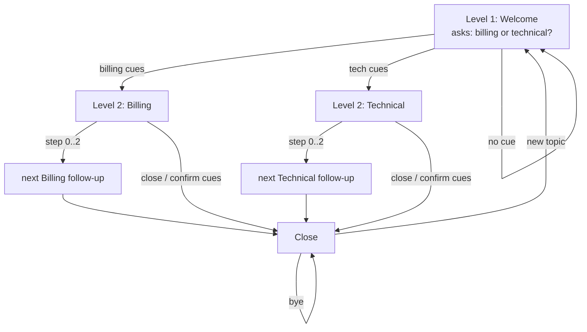

# `examples/gate_chat_bank_2level.rs` — Susutaku-chan (English)

> A dioxus-web customer-reply chatbot backed by `ket-rs`. Thai version:
> [GATE_CHAT_BANK_2LEVEL.th.md](GATE_CHAT_BANK_2LEVEL.th.md)

## What it is

A **browser chat demo** (Dioxus → WASM) where "Susutaku-chan" answers customer
messages. It shows how to drive a real conversation with the ket engine:

- **No LLM, no training** — every bot line is a fixed template string.
- **Two-level quest flow** — every bot turn ends with a question, then the app
  *waits* for the user's next message.
- **Grammar coaching side channel** — the bot politely corrects the user's
  English while helping them.
- **Inspectable decisions** — each reply prints which rules fired and the gate
  score, so you can always see *why* the bot spoke.

## How to run

```sh
dx serve --example gate_chat_bank_2level --platform web
# or, if configured: cargo run --example gate_chat_bank_2level
```

## The two-level quest flow



- **Level 1 (`Welcome`)** — greets, asks what the contact is about. Cue words
  in the reply route into a Level 2 quest.
- **Level 2 (`Billing` / `Technical`)** — three follow-up steps each
  (`BILLING_STEPS` / `TECH_STEPS`); confirm/close cues end the chain early.
- **`Close`** — logs everything, asks "anything else?" — a new topic re-enters
  `Welcome`, close cues keep it closed.

The state machine lives in `transition(current, step, text) -> Turn`: a pure
function from (quest, step, lowercased user text) to the next turn. Each quest
maps to one latent dim (`DIM_WELCOME..DIM_URGENT`).

## Cue banks (keyword routing)

| Bank | Fires when the user types… | Effect |
|---|---|---|
| `BILLING_CUES` | billing, refund, invoice, payment, … | route to Billing |
| `TECH_CUES` | bug, crash, slow, login, … | route to Technical |
| `CLOSE_CUES` | bye, that's all, done, … | end the chain |
| `CONFIRM_CUES` | yes, ok, correct, … | end the Level-2 chain (acknowledged) |
| `NEGATIVE_CUES` | angry, urgent, asap, … | raise the urgency dim |

`cue_hit` is a plain substring match on the lowercased text — deliberately
simple; all intelligence lives in the explicit cue lists.

## Encoding: text → latent evidence

`encode(next_quest, text)` builds a `STATE_DIM` evidence vector:

1. The **next quest's dim** gets `ROUTE_HIT` (0.5) — "the conversation is
   heading there".
2. **Negative cues** add `NEGATIVE_HIT` (1.5) to `DIM_URGENT`.
3. Each **fired grammar rule** adds `GRAMMAR_HIT` (1.0) to `DIM_URGENT` too —
   messy writing raises priority.
4. Every dim is clamped to `EVIDENCE_MAX` (3.0) by `bump`.

The returned `reasons` list is the *explainability* payload: the quest name +
`negative-sentiment` + every fired grammar rule name.

## The grammar side channel

`GRAMMAR_RULES` holds 19 rules (`GrammarRule { cues, name, fix }`) covering
classic learner mistakes: `capital-i`, `article-an`, `third-person-s`,
`double-modal`, `uncountable-plural`, `since-for`, … Each rule is a substring
cue list plus human-readable advice. `grammar_fixes(text)` returns the `fix`
strings of every rule that fired, in bank order — these are appended to the
bot's reply as "📖 Grammar tip" lines.

## The ket gate (why each reply is allowed to speak)

Per turn the app builds:

```rust
KetQuery {
    state: LatentState { dims, flags: FLAG_SAFE },
    question: TypedQuestion::Pick { keywords: ["support"], choices: [next_quest] },
}
```

`KetEngine::decide_into` runs the pipeline (validate → route → prune → score →
gate → urgency) and returns a `KetDecision`. The outcome drives the reply:

- `Ok(d)` → urgency prefix (`[priority]` / `[escalated]`) + prompt + grammar
  tips + footer `🧭 rules: [...] · score: 0.xx`.
- Gate rejected → the bot says so ("gate rejected (…)") — it never invents a
  fallback.
- Engine unavailable → "gate offline".

The engine is held in a `use_signal(KetEngine::new)` so its learned gate state
persists across turns.

## Dioxus app structure

| Piece | Role |
|---|---|
| `Message { from_user, text }` | one chat bubble |
| `messages` signal | chat transcript (starts with the Welcome prompt) |
| `draft` signal | the input box contents |
| `quest` / `step` signals | current position in the quest chain |
| `send` closure | push user msg → `transition` → `encode` → `decide_into` → push bot msg |

The UI is a single `rsx!` block: a scrollable transcript, a text input
(Enter = Send), and a Send button. Styling is inline CSS — no assets.

## Design takeaways

1. **Quests as enums + latent dims** — routing, scoring, and rendering all
   read the same `Quest` value; no duplicated state.
2. **Pure state machine** — `transition` has no side effects, so the flow is
   trivially testable.
3. **Explainability by construction** — reasons are the fired rule names, shown
   to the user, not hidden in logs.
4. **Zero training** — all "knowledge" is const cue/rule tables a human can
   read and edit.
