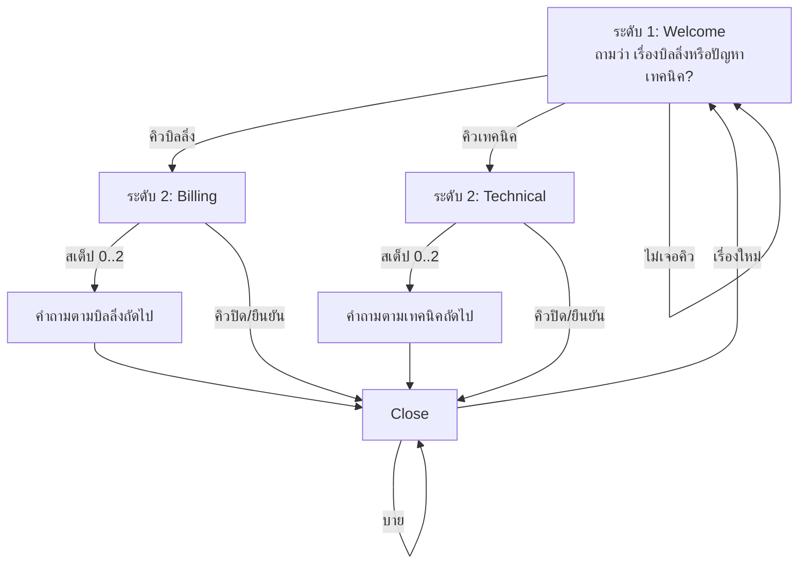

# `examples/gate_chat_bank_2level.rs` — Susutaku-chan (ไทย)

> แชตตอบลูกค้าบนเว็บ (dioxus-web) ที่ขับเคลื่อนด้วย `ket-rs`
> เวอร์ชันอังกฤษ: [GATE_CHAT_BANK_2LEVEL.en.md](GATE_CHAT_BANK_2LEVEL.en.md)

## นี่คืออะไร

**เดโมแชตในเบราว์เซอร์** (Dioxus → WASM) ที่ "Susutaku-chan" ตอบแชตลูกค้า
เป็นตัวอย่างการใช้ ket engine กับบทสนทนาจริง:

- **ไม่มี LLM ไม่ต้องเทรน** — ทุกประโยคของบอทเป็น template string ที่เขียนไว้ล่วงหน้า
- **โฟลว์เควสต์ 2 ระดับ** — ทุกเทิร์นของบอทจบด้วยคำถาม แล้วแอป *รอ*
  ข้อความถัดไปจากผู้ใช้
- **ช่องทางสอนไวยากรณ์** — บอทแก้ภาษาอังกฤษของผู้ใช้อย่างสุภาพระหว่างช่วยเหลือ
- **การตัดสินใจที่ตรวจสอบได้** — ทุกคำตอบพิมพ์ว่ากฎไหนทำงานบ้างและคะแนน gate
  เท่าไหร่ เห็น *เหตุผล* ที่บอทพูดเสมอ

## วิธีรัน

```sh
dx serve --example gate_chat_bank_2level --platform web
# หรือถ้าตั้งค่าไว้: cargo run --example gate_chat_bank_2level
```

## โฟลว์เควสต์ 2 ระดับ



- **ระดับ 1 (`Welcome`)** — ทักทาย ถามว่าติดต่อมาเรื่องอะไร คำสำคัญ (cue) ในคำตอบ
  จะ route เข้าเควสต์ระดับ 2
- **ระดับ 2 (`Billing` / `Technical`)** — มีคำถามตาม 3 สเต็ปต่อเรื่อง
  (`BILLING_STEPS` / `TECH_STEPS`); คิวยืนยัน/ปิดจะจบเชนก่อนเวลา
- **`Close`** — บันทึกทุกอย่างแล้วถามว่า "มีอะไรอีกไหม" — เรื่องใหม่วนกลับ
  `Welcome`, คิวปิดจะยังปิดต่อ

เครื่องจักรสถานะอยู่ใน `transition(current, step, text) -> Turn`: ฟังก์ชันบริสุทธิ์
จาก (เควสต์, สเต็ป, ข้อความผู้ใช้แบบตัวพิมพ์เล็ก) ไปยังเทิร์นถัดไป แต่ละเควสต์
ผูกกับ latent dim ของตัวเอง (`DIM_WELCOME..DIM_URGENT`)

## คลังคิว (การ routing ด้วยคำสำคัญ)

| คลัง | ทำงานเมื่อผู้ใช้พิมพ์… | ผลลัพธ์ |
|---|---|---|
| `BILLING_CUES` | billing, refund, invoice, payment, … | เข้า Billing |
| `TECH_CUES` | bug, crash, slow, login, … | เข้า Technical |
| `CLOSE_CUES` | bye, that's all, done, … | จบเชน |
| `CONFIRM_CUES` | yes, ok, correct, … | จบเชนระดับ 2 (รับทราบแล้ว) |
| `NEGATIVE_CUES` | angry, urgent, asap, … | เพิ่ม dim ความเร่งด่วน |

`cue_hit` เป็นแค่การหา substring ในข้อความตัวพิมพ์เล็ก — ตั้งใจให้เรียบง่าย
"ความฉลาด" ทั้งหมดอยู่ในลิสต์คิวที่เขียนไว้ชัดเจน

## การ encode: ข้อความ → หลักฐาน latent

`encode(next_quest, text)` สร้างเวกเตอร์หลักฐานขนาด `STATE_DIM`:

1. **dim ของเควสต์ถัดไป** ได้ `ROUTE_HIT` (0.5) — "บทสนทนากำลังไปทางนั้น"
2. **คิวเชิงลบ** เติม `NEGATIVE_HIT` (1.5) ให้ `DIM_URGENT`
3. **กฎไวยากรณ์ที่แฟ้มทำงาน** แต่ละข้อเติม `GRAMMAR_HIT` (1.0) ให้ `DIM_URGENT`
   ด้วย — การเขียนที่รกจะเพิ่มความสำคัญ
4. ทุก dim ถูก clamp ที่ `EVIDENCE_MAX` (3.0) โดย `bump`

ลิสต์ `reasons` ที่คืนมาคือชุดข้อมูล *อธิบายได้*: ชื่อเควสต์ +
`negative-sentiment` + ชื่อกฎไวยากรณ์ทุกข้อที่แฟ้มทำงาน

## ช่องทางไวยากรณ์

`GRAMMAR_RULES` มี 19 กฎ (`GrammarRule { cues, name, fix }`) ครอบคลุม
ความผิดพลาดคลาสสิกของผู้เรียน: `capital-i`, `article-an`, `third-person-s`,
`double-modal`, `uncountable-plural`, `since-for`, … แต่ละกฎคือลิสต์ cue
แบบ substring บวกคำแนะนำที่มนุษย์อ่านได้ `grammar_fixes(text)` คืน string
`fix` ของทุกกฎที่แฟ้มทำงาน เรียงตามลำดับในคลัง — แล้วต่อท้ายคำตอบของบอทเป็น
บรรทัด "📖 Grammar tip"

## ประตู ket (ทำไมแต่ละคำตอบถึง "ได้รับอนุญาตให้พูด")

ทุกเทิร์นแอปสร้าง:

```rust
KetQuery {
    state: LatentState { dims, flags: FLAG_SAFE },
    question: TypedQuestion::Pick { keywords: ["support"], choices: [next_quest] },
}
```

`KetEngine::decide_into` รันไปป์ไลน์ (validate → route → prune → score →
gate → urgency) แล้วคืน `KetDecision` ผลลัพธ์กำหนดคำตอบ:

- `Ok(d)` → คำนำหน้าตามความเร่งด่วน (`[priority]` / `[escalated]`) + prompt +
  grammar tips + ท้ายบรรทัด `🧭 rules: [...] · score: 0.xx`
- gate ปฏิเสธ → บอทบอกตรง ๆ ("gate rejected (…)") — ไม่เคยมั่วคำตอบแทน
- engine ไม่พร้อม → "gate offline"

engine ถูกเก็บใน `use_signal(KetEngine::new)` เพื่อให้สถานะ gate ที่เรียนรู้
คงอยู่ข้ามเทิร์น

## โครงสร้างแอป Dioxus

| ส่วน | หน้าที่ |
|---|---|
| `Message { from_user, text }` | ฟองแชตหนึ่งฟอง |
| signal `messages` | ประวัติแชต (เริ่มด้วย prompt ของ Welcome) |
| signal `draft` | เนื้อความในช่องพิมพ์ |
| signal `quest` / `step` | ตำแหน่งปัจจุบันในเชนเควสต์ |
| closure `send` | เพิ่มข้อความผู้ใช้ → `transition` → `encode` → `decide_into` → เพิ่มข้อความบอท |

UI เป็น `rsx!` บล็อกเดียว: transcript แบบเลื่อนได้, ช่องพิมพ์ (Enter = ส่ง)
และปุ่ม Send สไตล์เป็น inline CSS — ไม่มีไฟล์ asset

## แนวคิดการออกแบบที่ควรจับ

1. **เควสต์เป็น enum + latent dim** — routing, scoring และการ render อ่านค่า
   `Quest` ตัวเดียวกัน ไม่มีสถานะซ้ำซ้อน
2. **เครื่องจักรสถานะบริสุทธิ์** — `transition` ไม่มี side effect ทดสอบได้ง่ายมาก
3. **อธิบายได้ตั้งแต่การออกแบบ** — เหตุผลคือชื่อกฎที่แฟ้มทำงาน แสดงให้ผู้ใช้เห็น
   ไม่ซ่อนใน log
4. **ไม่ต้องเทรน** — "ความรู้" ทั้งหมดเป็นตาราง cue/กฎแบบ const ที่มนุษย์
   อ่านและแก้ไขได้
