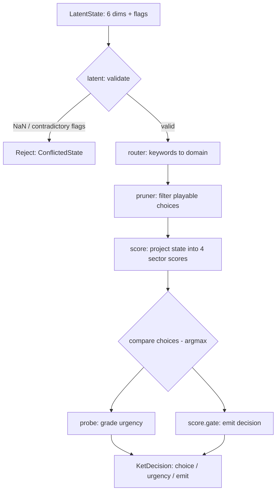

# ket-rs — Plain-Language Overview (English)

> This file explains *what each part of the project does and why it computes
> the way it does*, using human-friendly abstractions. Thai version:
> [OVERVIEW.th.md](OVERVIEW.th.md)

## The big picture: what is this project

`ket-rs` is a **modelless decision engine** — no training, no text generation.
It answers exactly one question:

> "Given current state + a typed question → **which choice wins, how urgent is
> it, and should it be emitted (spoken) now**"

Mental image: a **triage nurse in an emergency room**.
- A patient walks in with "symptoms" (state = 6 numbers)
- The nurse reads them → routes to the right specialist (Safety / Time / Resource / General)
- Grades "how urgent" (Routine / Elevated / Critical)
- Then decides "call the doctor now, or wait and observe"

## Vocabulary primer

| Term | Plain meaning |
|---|---|
| **latent** | A numeric vector that "summarizes" program state — like indicator lights on a dashboard; each cell is "evidence" that something is happening |
| **dim / dimension** | One cell of that vector (here: 6 cells) |
| **argmax** | Pick the largest value — grab the cell with the highest accumulated score |
| **sigmoid** | An S-shaped curve squashing any number into 0..1 — like a "confidence percentage" |
| **softmax (deliberately avoided)** | The usual way to turn scores into probabilities — this project **avoids** it; real-time decisions don't need that distribution |
| **ternary** | Three-way value: −1, 0, +1 — "push / ignore / resist" |
| **sector** | An expert domain: Safety, Time, Resource, General |
| **gate** | A pass/fail gate deciding whether to **emit** (act/speak) or hold |
| **bandit / exploration** | Gambling-derived technique: occasionally try uncertain options so you never miss a better one |
| **conformal interval** | Statistical confidence band: "the answer is between lo–hi at 95% level" |
| **zero-alloc** | Code that never allocates memory at runtime → fast and predictable latency |

## How the pipeline flows

---

## Per-file walkthrough

### `src/latent.rs` — the state board + sanity inspector

**What:** `LatentState` = a read-only view into a 6-cell vector plus bit flags (`FLAG_ARMED`, `FLAG_SAFE`, `FLAG_DISARMED`).

**Why:**
- `STATE_DIM = 6` is a compile-time constant → the compiler lays out a fixed stack buffer; no allocation.
- Zero-copy (`dims: &[f32]` borrows, never clones) — pass data by pointing, not by carrying a duplicate bag.
- `KetConflictDetector.is_valid` checks two things:
  - any NaN/Infinity cell → broken state, stop before computing more
  - `ARMED` together with `DISARMED` → logical contradiction, like "the safe is unlocked AND still locked"

**Image:** the nurse glancing at the monitor — if it reads "Err", no diagnosis proceeds.

### `src/question.rs` — typed questions

**What:** defines `TypedQuestion` (3 variants), `ChoiceId`, `Urgency`.
- `Pick { keywords, choices }` — "match keywords, pick from choices"
- `PickWeighted { …, directions }` — like Pick, but **each choice wears different glasses**: same state, different emphasis per choice
- `Score { choices }` — ignore keywords, score choices directly

**Why:** enums instead of `String` → the compiler catches mistakes at build time, like a form where you can only tick real checkboxes.

### `src/score.rs` — the computational heart: project state → sector scores

Two stacks live here:

**1) Sector projection:**
- Rules are written as **relations** (`SECTOR_RULES`): "sector X is pushed by dim A and resisted by dim B"
  - e.g. Safety is pushed by `SpeakAxis`, resisted by `Resist`
  - Resource reads the "coin" dims (`CoinX`, `CoinY`) — the coin's bearing tilts the resource score directionally
- `const fn ternary_bank()` then **derives the −1/0/+1 matrix at compile time** — nobody hand-writes an array
- "Projecting" = dot product of the state with each row, then sigmoid → a 0..1 score per sector

**Image:** four rulers laid at different angles; the one aligned with the state's direction reads highest.

**2) SalienceTriGate (the two-layer emit gate):**
- Reads the state through two weight vectors (`D_SPEAK`, `D_DELEGATE`) → two stacked sigmoids
- Weights like SpeakAxis=0.9 in D_SPEAK mean "should I speak" mostly watches the speak dim
- `BETA = 6.0` is the S-curve sharpness: higher = sharper, more decisive (closer to 0/1, less wishy-washy)

**Why no softmax:** this engine wants to *decide*, not to *enumerate probabilities*. A sigmoid per option is faster and easier to interpret.

**Builder:** `KetScorer::builder()` lets you tweak rules piecewise (a sector, a weight) without touching the core.

### `src/router.rs` — the receptionist forwarding calls

**What:** `KeywordRouter::route(keywords)` → one domain (Safety/Time/Resource/General), e.g. `"risk"` → Safety.

**How it computes (smooth-min):**
- Per domain: check each keyword → 1.0 (hit) / 0.0 (miss)
- `smooth_min_similarity` is a "soft" minimum — it picks the domain by asking **how bad the worst keyword in that bank is**
- Why smooth-min instead of average: a domain should *fully* match its signals — like a surgical checklist, you need every item, not an 80% average.

**Fallback:** no hits at all → General (sees every sector).

### `src/pruner.rs` — the bouncer before the expensive room

**What:** `prune_choices` filters choices that pass structural constraints: depth ≤ `MAX_DEPTH (8)`, token index < 64, parent path short enough.

**Image:** before 50 judges score contestants, kick out anyone with an incomplete application — cheaper, and no wasted scores.

**Why:** less computation = faster answers, and `NoValidChoices` is caught at the door.

### `src/decision.rs` — the engine assembling everything

**What:** `KetEngine` runs the pipeline: **validate → route → prune → project → score → gate → tag urgency**, producing `KetDecision { choice, urgency, emit }`. No prose ever attached.

**How to read it:**
- `plan()` does the heavy work (string matching, routing) **once per question** → caches into `DecisionPlan` (domain + surviving candidate list)
- `decide_into()` runs per tick: project + argmax + gate — strings are never touched again
- With `PickWeighted`: score = ½ state score + ½ logistic(dot(choice direction, state)) — a 50:50 blend of "overall situation" and "how well this specific choice fits" (`CHOICE_STATE_WEIGHT` / `CHOICE_DIR_WEIGHT`)
- Outputs are written into caller-provided buffers (`decide_into`) → zero allocation in the hot path

**Image:** plan = "lay out the ingredients on the counter"; tick = "plate one dish" — no re-running to the kitchen.

### `src/probe.rs` — the urgency meter

**What:** `UrgencyProbe.tag(dims)` → Routine / Elevated / Critical.

**How:**
- Three direction rows (like dials): Routine tilts gently, Critical leans hard onto SpeakAxis (0.9) and subtracts Resist (−0.2)
- Dot with the state → sigmoid → compare against thresholds (0.45 / 0.55 / 0.75)
- **OR-fusion**: the strongest label that still beats `TAU_FIRE` wins — like multiple alarms; the loudest one is the one you heed.

### `src/exploration.rs` — systematic trial-and-error (bandit)

**What:** `ExplorationArms<N>` = N choices, each holding a Beta "belief".
- `thompson(i)` — sample a score from the belief (Thompson sampling) → sometimes try an uncertain option
- `observe(i, reward, t)` — update the belief when reality answers
- `select_conservative()` — pick the option whose **worst plausible case is still good** (ε=0.05 quantile lower bound) → never a reckless gamble

**Image:** choosing a restaurant: some days try the new place (Thompson), but on an important night pick the one whose *worst past meal was still tasty* (best belief).

**Why not in the hot path:** this is for offline learning/tuning; actual decisions stay deterministic.

### `src/conformal.rs` — confidence with a floor under it (optional, feature `ket_conformal`)

**What:** `KetConfidence` produces a `[lo, point, hi]` band at 95% level (`ALPHA = 0.05`) for "where the next score will land".

**How:**
- Next-score prediction via **two-tap extrapolation**: ŷ ≈ √2·s_t − s_{t−1} — a closed form that cancels a locally-sinusoidal signal, leaving only noise in the pool
- Stores the last 256 residuals → their quantiles set the band width
- `seasonal_naive_floor_calibrator()` is the **baseline rival**: "if naive repetition gets this band, your model must beat it" (the "Report the Floor" idea)

**Image:** weather forecasts don't say "30 degrees"; they say "28–32, 95% confident" — the band tells you how often the forecaster was wrong in the past.

---

## Summary: who talks to whom

| File | Single role | Reads | Produces |
|---|---|---|---|
| `latent` | state board + validator | 6-cell vector | pass/fail |
| `question` | typed questions | — | question shape |
| `router` | domain picker | keywords | Domain |
| `pruner` | choice filter | structural constraints | survivors |
| `score` | projection + gate | state | 4 sector scores + emit |
| `probe` | urgency grader | state | Urgency |
| `decision` | assembles all steps | state + question | KetDecision |
| `exploration` | learning to try | rewards | conservative pick |
| `conformal` | confidence interval | score history | [lo, point, hi] |

**Design principles woven through everything:**
1. **Explainability by construction** — scores come from named rules, so the reasons are exactly the fired rules
2. **No training** — knowledge is explicitly written rules
3. **Zero-alloc + zero-copy** — for real-time: fast, predictable latency
4. **Enums over strings** — let the compiler be the mistake-catcher
5. **Rules as relations, not hand-written arrays** — change a rule once; the derived (const fn) numbers stay correct automatically
