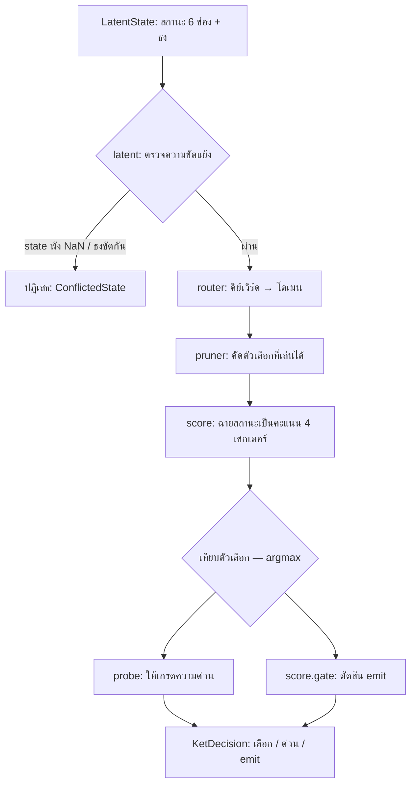

# ket-rs — อธิบายภาพรวมฉบับเข้าใจง่าย (ภาษาไทย)

> ไฟล์นี้อธิบายว่า "แต่ละส่วนในโปรเจกต์ทำอะไร และทำไมต้องคำนวณแบบนั้น"
> โดยใช้ภาพจำเชิงนามธรรมที่มนุษย์เข้าใจง่าย พร้อมอธิบายศัพท์เฉพาะที่พบบ่อย
> ดูภาษาอังกฤษได้ที่ [OVERVIEW.en.md](OVERVIEW.en.md)

## ภาพใหญ่: โปรเจกต์นี้คืออะไร

`ket-rs` คือ **เครื่องตัดสินใจแบบไม่ต้องเทรนโมเดล** (modelless)
ไม่มีการเรียนรู้จากข้อมูล ไม่มีการสร้างข้อความ — มันแค่ตอบคำถามเดียว:

> "จากสถานะปัจจุบัน + คำถามที่พิมพ์มา → **ควรเลือกทางไหน ด่วนแค่ไหน และควรพูดออกมาเลยไหม**"

ภาพจำ: เหมือน **พยาบาลคัดกรองในห้องฉุกเฉิน**
- ผู้ป่วยเดินเข้ามาพร้อม "อาการ" (สถานะ = ตัวเลข 6 ช่อง)
- พยาบาลอ่านอาการ → ส่งต่อหมอสายที่ถูก (Safe / Time / Resource / General)
- ประเมิน "ด่วนแค่ไหน" (Routine / Elevated / Critical)
- แล้วตัดสินใจว่าจะ "เรียกหมอเลย หรือรอดูอาการก่อน"

## ศัพท์เฉพาะที่ต้องรู้ก่อน

| ศัพท์ | ความหมายแบบมนุษย์ |
|---|---|
| **latent** (แฝง) | เวกเตอร์ตัวเลขที่ "สรุป" สถานะโปรแกรม — เหมือนชุดตัวชี้วัดบนกระดาน: ค่าแต่ละช่องคือ "หลักฐาน" ว่าอะไรกำลังเกิดขึ้น |
| **dim / dimension** | ช่องหนึ่งในเวกเตอร์นั้น (ที่นี่มี 6 ช่อง) |
| **argmax** | เลือกค่าที่มากที่สุด — เหมือนหยิบช่องที่ "จุดสะสมสูงสุด" |
| **sigmoid** | ฟังก์ชันโค้ง S ที่บีบตัวเลขใด ๆ ให้เป็น 0..1 เหมือน "เปอร์เซ็นต์ความมั่นใจ" |
| **softmax ที่ไม่ใช้** | การแปลงคะแนนเป็นความน่าจะเป็นแบบปกติ — โปรเจกต์นี้ **หลีกเลี่ยง** เพราะซอฟต์แวร์ real-time ไม่ต้องการความน่าจะเป็นแบบนั้น |
| **ternary** | ค่า 3 ทาง: −1, 0, +1 — "ผลัก / ไม่สน / ต้าน" |
| **sector** (เซกเตอร์) | โดเมนผู้เชี่ยวชาญ: Safety, Time, Resource, General |
| **gate** (ประตู) | ตัวตัดสินว่าจะ "ปล่อยผ่าน" (emit) หรือ "กักไว้" ก่อน |
| **bandit / exploration** | เทคนิคจากการพนัน: ลองทางเลือกที่ยังไม่แน่ใจบ้าง กลัวเสียโอกาสทางที่ดีที่สุด |
| **conformal interval** | ช่วงความเชื่อมั่นทางสถิติ: "ตอบอยู่ระหว่าง lo–hi ที่ระดับ 95%" |
| **zero-alloc** | เขียนโค้ดโดยไม่จองหน่วยความจำใหม่ตอน runtime → เร็วและคาดเดาได้ |

## ท่อประมวลผล (pipeline) ไหลอย่างไร

---

## รายละเอียดแต่ละไฟล์

### `src/latent.rs` — กระดานสถานะ + ผู้ตรวจความสมเหตุสมผล

**ทำอะไร:** นิยาม `LatentState` = มุมมอง (view) อ่านอย่างเดียวเข้าเวกเตอร์ 6 ช่อง + ธงบิต (`FLAG_ARMED`, `FLAG_SAFE`, `FLAG_DISARMED`)

**ทำไม:**
- `STATE_DIM = 6` คงที่ตายตัว → คอมไพเลอร์จัดสแตกให้พอดี ไม่มี allocation
- Zero-copy (`dims: &[f32]` ยืมมา ไม่ clone) → ผ่านข้อมูลแบบ "ชี้นิ้ว" ไม่ใช่ "พกกระเป๋าซ้ำ"
- `KetConflictDetector.is_valid` ตรวจ 2 อย่าง:
  - ช่องไหนเป็น NaN/Infinity → สถานะพัง หยุดก่อนคำนวณต่อ
  - `ARMED` พร้อม `DISARMED` พร้อมกัน → ขัดแย้งเชิงตรรกะ เหมือน "ปลดล็อกนิรภัยแล้ว + ยังล็อกอยู่"

**ภาพจำ:** เหมือนพยาบาลดูเครื่องวัดความดันก่อน — ถ้าเครื่องโชว์ "Err" ก็ไม่วินิจฉัยต่อ

### `src/question.rs` — คำถามที่พิมพ์เป็นชนิด (typed)

**ทำอะไร:** นิยาม `TypedQuestion` 3 แบบ + `ChoiceId` + `Urgency`
- `Pick { keywords, choices }` — "จับคู่คำ แล้วเลือกจากตัวเลือก"
- `PickWeighted { …, directions }` — เหมือน Pick แต่ **แต่ละตัวเลือกมีแว่นตาคนละตัว**: อ่านสถานะเดียวกัน แต่ให้น้ำหนักต่างกัน
- `Score { choices }` — ไม่สนคีย์เวิร์ด ให้คะแนนตรง ๆ

**ทำไม:** ใช้ `enum` ไม่ใช้ `String` → คอมไพเลอร์จับพลาดตอนคอมไพล์ เหมือนแบบฟอร์มที่ติ๊กได้แค่ช่องที่มีอยู่จริง

### `src/score.rs` — หัวใจของการคำนวณ: ฉายสถานะ → คะแนนเซกเตอร์

นี่คือไฟล์ที่ "คณิต" เกิดขึ้นจริง มี 2 สแตก:

**1) Sector projection (ฉายเป็นเซกเตอร์):**
- กติกาเขียนเป็น **ความสัมพันธ์** (`SECTOR_RULES`): "เซกเตอร์ X ถูกผลักโดยมิติ A และถูกต้านโดยมิติ B"
  - เช่น Safety ถูก `SpeakAxis` ผลัก, ถูก `Resist` ต้าน
  - Resource อ่านค่า "เหรียญ" (`CoinX`, `CoinY`) → ทิศทางเหรียญเอียงไปทางไหน คะแนนทรัพยากรก็เอนตาม
- จากนั้น `const fn ternary_bank()` **แปลงความสัมพันธ์เป็นเมทริกซ์ −1/0/+1 ตอนคอมไพล์** — ไม่มีใครเขียนอาร์เรย์มือ
- การ "ฉาย" = dot product ของสถานะกับแต่ละแถว แล้ว sigmoid → คะแนน 0..1 ต่อเซกเตอร์

**ภาพจำ:** เหมือนคุณมีไม้บรรทัด 4 อันวางคนละมุม ค่อย ๆ เอียงไม้บรรทัดที่ตรงกับทิศสถานะมากสุด = คะแนนสูงสุด

**2) SalienceTriGate (ประตู emit สองชั้น):**
- อ่านสถานะผ่าน 2 เวกเตอร์น้ำหนัก (`D_SPEAK`, `D_DELEGATE`) → sigmoid ต่อกัน 2 ชั้น
- ค่าน้ำหนักเช่น SpeakAxis=0.9 ใน D_SPEAK → "ควรพูดไหม" ดูมิติ speak เป็นหลัก
- `BETA = 6.0` คือ "ความคมของโค้ง S": ยิ่งสูง ยิ่งตัดสินแบบชัด ๆ (ใกล้ 0/1) ไม่ก้ำกึ่ง

**ทำไมไม่ softmax:** โปรเจกต์ต้องการ "ตัดสินใจ" ไม่ใช่ "แจกแจงน่าจะเป็น" — sigmoid ต่อทางเลือกเร็วกว่าและตีความง่ายกว่า

**Builder:** `KetScorer::builder()` ให้ปรับกติกาทีละชิ้น (เปลี่ยนเซกเตอร์ เปลี่ยนน้ำหนัก) โดยไม่แตะโค้ดหลัก

### `src/router.rs` — พนักงานต้อนรับส่งต่อสาย

**ทำอะไร:** `KeywordRouter::route(keywords)` → โดเมนเดียว (Safety/Time/Resource/General) จากคีย์เวิร์ด เช่น `"risk"` → Safety

**คำนวณอย่างไร (smooth-min):**
- ต่อโดเมน: ตรวจคีย์เวิร์ดทีละคำ → 1.0 (เจอ) / 0.0 (พลาด)
- `smooth_min_similarity` = minimum แบบ "นุ่ม" — ตัวเลือกโดเมนโดยดูว่า **คำที่แย่ที่สุดในธนาคารนั้นแย่แค่ไหน**
- ทำไม smooth-min ไม่ใช่ค่าเฉลี่ย: โดเมนควรต้อง "ครบ" ทุกสัญญาณ — เหมือนห้องผ่าตัดต้องผ่านทุก checklist ข้อ ไม่ใช่เฉลี่ย 80%

**Fallback:** ไม่เจอคำเลย → General (ดูทุกเซกเตอร์)

### `src/pruner.rs` — คนตัดตัวเลือกก่อนคำนวณ

**ทำอะไร:** `prune_choices` กรองตัวเลือกที่ผ่านเงื่อนไขโครงสร้าง: ความลึก ≤ `MAX_DEPTH (8)`, ดัชนี token < 64, เส้นทางพ่อแม่สั้นพอ

**ภาพจำ:** ก่อนให้กรรมการให้คะแนน 50 คน กรองคนที่ "ยื่นใบสมัครไม่ครบ" ออกก่อน — ถูกกว่าและไม่มีผลลัพธ์เสีย

**ทำไม:** คำนวณน้อยลง = ตอบเร็ว และ `NoValidChoices` ตรวจได้ตั้งแต่ต้นทาง

### `src/decision.rs` — เครื่องยนต์ตัดสิน (ประกอบทุกอย่าง)

**ทำอะไร:** `KetEngine` รัน pipeline: **ตรวจ → route → prune → ฉาย → ให้คะแนน → gate → ให้เกรดความด่วน**

ออกเป็น `KetDecision { choice, urgency, emit }` — ไม่มี prose (ข้อความ) ติดมาเลย

**อ่านอย่างนี้:**
- `plan()` รันหนัก ๆ (จับคู่ string, route) **ครั้งเดียวต่อคำถาม** → เก็บเป็น `DecisionPlan` (โดเมน + รายชื่อตัวเลือกที่รอด)
- `decide_into()` รันต่อ tick: ฉาย + argmax + gate — ไม่แตะ string อีกเลย
- แบบ `PickWeighted`: คะแนน = ½ คะแนนสถานะ + ½ logistic(dot(ทิศทางตัวเลือก, สถานะ)) — ผสม "สภาพรวม" กับ "ความเข้ากันของตัวเลือกนั้น" 50:50 (`CHOICE_STATE_WEIGHT` / `CHOICE_DIR_WEIGHT`)
- ผลลัพธ์เขียนลง buffer ที่ผู้เรียกส่งมา (`decide_into`) → ไม่มี allocation ใน hot path

**ภาพจำ:** แผนคือ "เตรียมของบนเคาน์เตอร์ไว้ก่อน" ส่วน tick คือ "หยิบใส่จานทีละอย่าง" — ไม่วิ่งไปห้องครัวซ้ำ

### `src/probe.rs` — เครื่องวัดความด่วน

**ทำอะไร:** `UrgencyProbe.tag(dims)` → Routine / Elevated / Critical

**คำนวณอย่างไร:**
- มี 3 แถวทิศทาง (ท่าจอแชร์): Routine เอนเบา ๆ, Critical เอนแรงไปที่ SpeakAxis (0.9) และหักลบ Resist (−0.2)
- dot product กับสถานะ → sigmoid → เทียบ threshold (0.45 / 0.55 / 0.75)
- **OR-fusion**: label ที่แรงสุดที่ยังผ่าน `TAU_FIRE` ชนะ — เหมือนสัญญาณเตือนหลายตัว ตัวไหนกรี๊ดแรงสุดก็ใช้ตัวนั้น

### `src/exploration.rs` — การลองผิดลองถูกอย่างมีระบบ (bandit)

**ทำอะไร:** `ExplorationArms<N>` = ตัวเลือก N ตัว แต่ละตัวมี "ความเชื่อ" แบบ Beta
- `thompson(i)` — สุ่มคะแนนจากความเชื่อ (Thompson sampling) → บางครั้งลองทางที่ยังไม่แน่ใจ
- `observe(i, reward, t)` — อัปเดตความเชื่อเมื่อรู้ผลจริง
- `select_conservative()` — เลือกทางที่ **แย่สุดแล้วยังดีพอ** (lower bound ที่ quantile ε=0.05) → ไม่เสี่ยงโง่ ๆ

**ภาพจำ:** เหมือนเลือกร้านอาหาร: บางวันลองร้านใหม่ (Thompson) แต่วันสำคัญเลือกร้านที่ "แย่ที่สุดเท่าที่เคยเจอก็ยังอร่อย" (best belief)

**ทำไมไม่ใช้ใน hot path:** ตัวนี้สำหรับการเรียนรู้ออฟไลน์/ตั้งค่าระบบ ส่วนตัดสินใจจริงยัง deterministic

### `src/conformal.rs` — ความมั่นใจที่มี "พื้น" รอง (optional, feature `ket_conformal`)

**ทำอะไร:** `KetConfidence` ให้ช่วง `[lo, point, hi]` ที่ระดับ 95% (`ALPHA = 0.05`) ว่า "คะแนนรอบหน้าน่าจะอยู่ตรงไหน"

**คำนวณอย่างไร:**
- ทำนายคะแนนถัดไปด้วย **สองจุด extrapolation**: ŷ ≈ √2·s_t − s_{t−1} — สูตรปิดที่ตัดสัญญาณคลื่นไซน์ออก เหลือแต่ noise ใน pool
- เก็บความคลาดเคลื่อน (residual) ย้อนหลัง 256 ค่า → quantile ของความคลาดเคลื่อน = ความกว้างช่วง
- มี `seasonal_naive_floor_calibrator()` เป็น **คู่แข่งพื้นฐาน**: "ถ้าทายซ้ำค่าเดิมง่าย ๆ ก็ได้ช่วงเท่านี้ โมเดลต้องทำได้ดีกว่านี้" (แนวคิด "Report the Floor")

**ภาพจำ:** พยากรณ์อากาศไม่ได้บอกแค่ "30 องศา" แต่บอก "28–32 องศา มั่นใจ 95%" — ช่วงที่บอกคือ "ผมพลาดบ่อยแค่ไหนในอดีต"

---

## สรุป: ใครทำงานกับใคร

| ไฟล์ | บทบาทเดียว | อ่านอะไร | ผลิตอะไร |
|---|---|---|---|
| `latent` | กระดาน + ตรวจสถานะ | เวกเตอร์ 6 ช่อง | ผ่าน/ไม่ผ่าน |
| `question` | คำถาม typed | — | โครงคำถาม |
| `router` | เลือกโดเมน | keywords | Domain |
| `pruner` | คัดตัวเลือก | เงื่อนไขโครงสร้าง | รายชื่อที่รอด |
| `score` | ฉาย + gate | สถานะ | คะแนน 4 เซกเตอร์ + emit |
| `probe` | เกรดความด่วน | สถานะ | Urgency |
| `decision` | ประกอบทุกขั้น | state + question | KetDecision |
| `exploration` | ลองเรียนรู้ | reward | ทางเลือกที่ conservative |
| `conformal` | ช่วงความมั่นใจ | ประวัติคะแนน | [lo, point, hi] |

**หลักการออกแบบที่ซ่อนอยู่ทั้งหมด:**
1. **อธิบายได้โดยการสร้าง (by construction)** — เพราะคะแนนมาจากกติกาที่มีชื่อ เหตุผล = กติกาที่ยิง
2. **ไม่มี training** — ความรู้คือกติกาที่เขียนไว้ชัด ๆ
3. **zero-alloc + zero-copy** — สำหรับ real-time: เร็ว คาดเดา latency ได้
4. **enums แทน string** — ให้คอมไพเลอร์เป็นเพื่อนจับผิด
5. **กติกาเป็น relation ไม่ใช่ array มือ** — แก้กติกาที่เดียว ตัวเลขที่ได้มา (const fn) ถูกต้องเอง
